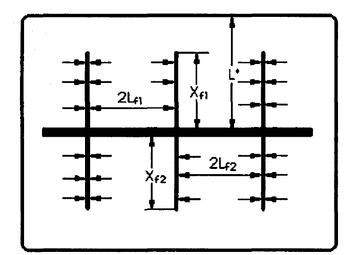
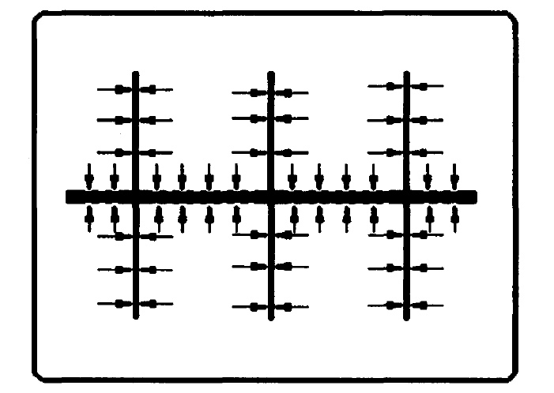

# Название статьи

[Главная таблица](../../main.md)

Детали

<dl>
    <dt>авторы:</dt>
    <dd>Hujun Li, Zhengqi Jia, and Zhaosheng Wei,</dd>
    <dt>год:</dt>
    <dd>1996</dd>
    <dt>doi:</dt>
    <dd><a href ="https://doi.org/10.2118/37051-MS">Cсылка</a></dd>
    <dt>tags:</dt>
    <dd>MSHFHW, productivity, resistance theory</dd>
    <dt>создано:</dt>
    <dd>08.02.2024</dd>
    <dt>обновлено:</dt>
    <dd>14.05.2024</dd>
</dl>

Используются электролитические эксперименты по моделированию.

Две упрощенные модели:

1. ГС с МГРП: предполагается два течения: от контура дренирования в трещины, из трещин в ГС. все течение может быть поделено на $N$ регионов вдоль ствола ГС, каждый из которых содержит в центре себя трещину (рис. 1).

Рис. 1

2. ГС с МГРП и ГС перфорирована, тогда течения будут из пласта в трещину и далее в скважина и из пласта непосредственно в скважину. все течение может быть поделено на $N$ регионов вдоль ствола ГС, каждый из которых содержит в центре себя трещину и участок ствола ГС (рис. 2).

Рис. 2

## Математическая модель

### ГС с $N$ вертикальными трещинами
Сумма притока из каждого региона.
Перепад давления:

$$
\triangle p = ...
$$

Дебит i-ой трещины
$$
\triangle p = p_r - p_w = \dfrac{Q_i \mu}{2}
\left[
    \dfrac{L^* - x_f}{kh \left({L_f}_1 + {L_f}_2\right)} + 
    \dfrac{1}{k h x_f \left(\dfrac{1}{{L_f}_1} + \dfrac{1}{{L_f}_2} \right)} +
    \dfrac{x_f}{k_f h w} +
    \dfrac{1}{k_f w \pi} \left( \ln \dfrac{h}{2r_w} - \dfrac{\pi}{2}\right)
\right]
$$

$$
Q_i = \dfrac{2\pi k h \left(p_r - p_w\right)}{\mu} \cdot \dfrac{1}{A}
$$

$$
A = \dfrac{\pi \left(L^* - x_f\right)}{\left({L_f}_1 + {L_f}_2\right)} + 
    \dfrac{\pi}{x_f \left(\dfrac{1}{{L_f}_1} + \dfrac{1}{{L_f}_2} \right)} +
    \dfrac{\pi x_f k}{k_f w} +
    \dfrac{k h}{k_f w} \left( \ln \dfrac{h}{2r_w} - \dfrac{\pi}{2}\right)
$$

Просуммировать от 1 до N. 

#### Похожие статьи

##### Список литературы

[Главная таблица](../../main.md)
