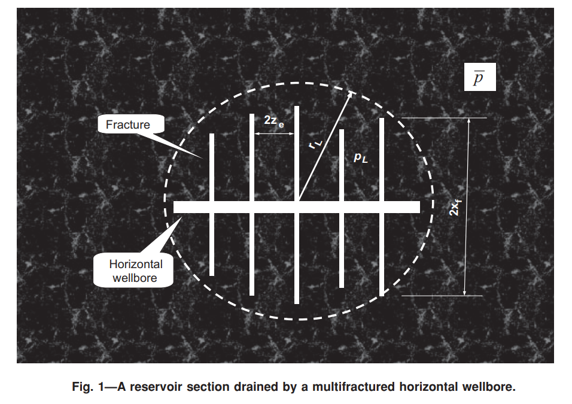

# A Simple Analytical Model for Predicting Productivity of Multifractured Horizontal Wells

[Главная таблица](../../main.md)

<dl>
    <dt>авторы:</dt>    
    <dd>Guo, B., Yu, X., & Khoshgahdam, M.</dd>
    <dt>год:</dt>
    <dd>2009</dd>
    <dt>doi:</dt>
    <dd><a href ="https://doi.org/10.2118/114452-PA">Cсылка</a></dd>
    <dt>tags:</dt>
    <dd>your_KEYWORDS</dd>
    <dt>создано:</dt>
    <dd>29.01.2024</dd>
    <dt>обновлено:</dt>
    <dd>11.02.2024</dd>    
</dl>

Рис.1 

Есть внутренняя и внешняя области.
Внутренняя область содержит в себе ГС с МГРП (рис. 1).
На границе внешней и внутренней областей задано давление $p_L$. 
Полный **радиальный** приток из внешней области во внутренюю

$$
q = coeff * \left(\bar{p} - p_L\right),  \;\;\;\;\;\;\;\;\;\;\;\; (1)
$$
где $coeff$ это коэффициент, $\bar{p}$ -- некое среднее давление во внешней области.

Тут все понятно. 

Но потом авторы предлагают определить сколько линейный приток к трещинам, сколько радиальный. 
и в итоге полный дебит к такой системе это $q$ из (1) + еще что-то. видимо, такое может быть, если только есть упругий режим? иначе откуда появится дополнительный приток. $q$ из (1) это уже есть полный приток.

Потом говорят что может быть поток через границу внутренеей области, или его может не быть
вот перевод этого отрезка
"
Если скважина с множественными трещинами используется для дренирования участка пласта с физическими границами отсутствия потока, коэффициент формы зоны дренирования

CA можно оценить на основе формы сечения пласта и расположения внутренней области в разрезе пласта. Если скважина с множественными трещинами используется для дренирования части сплошного коллектора, СА следует оценивать на основе формы области дренирования, причем расположение внутренней области находится в центре области дренирования. Соотношение сторон (длина к ширине)
Площадь дренажа можно принять за ...(здесь формула)
"

#### Похожие статьи

##### Список литературы

[Главная таблица](../../main.md)