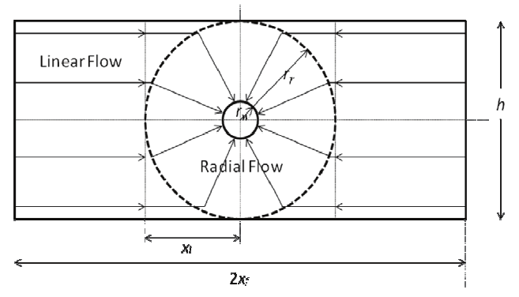
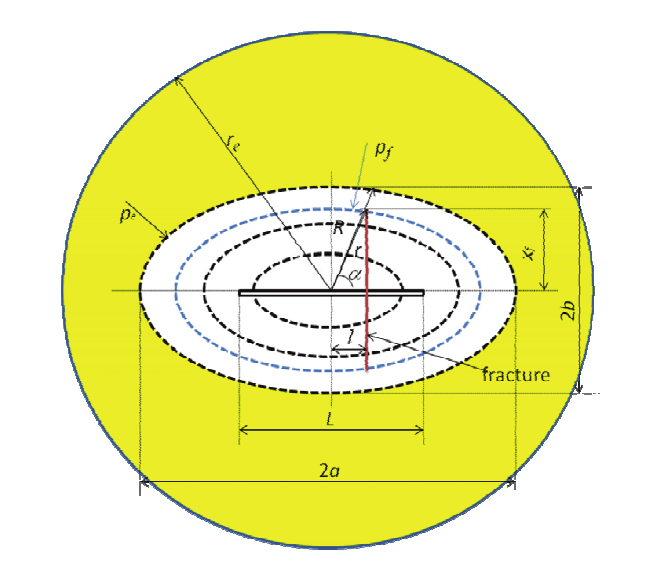

# A New Model for Predicting Inflow Performance of Fractured Horizontal Wells

[Главная таблица](../../main)

<dl>
    <dt>авторы:</dt>
    <dd>Hong Yuan, Desheng Zhou</dd>
    <dt>год:</dt>
    <dd>2010</dd>
    <dt>doi:</dt>
    <dd><a href ="https://doi.org/10.2118/133610-MS">Cсылка</a></dd>
    <dt>tags:</dt>
    <dd>{your KEYWORDS}</dd>
    <dt>создано:</dt>
    <dd>07.02.2024</dd>
    <dt>обновлено:</dt>
    <dd>07.02.2024</dd>  
</dl>

> [!NOTE]
> В оригинальных формулах были убраны объемные коэффициенты.

## Номенклатура

- ГС -- горизонтальная скважина;
- МГРП - многостадийный гидроразрыв пласта;
- ВС -- вертикальная скважина;

## Аннотация

В данной  работе представлен новый метод оценки дебита ГС с МГРП.
Учитывается поток из пласта в скважину и из трещин в скважину. Модель может быть применена к ГС с МГРП и без.
Результаты модели были сопоставлены с результатами широко используемых моделей, таких как Economides, Joshi, Badu и Odeh, Guo и Schechter.

## Введение

ГС лучше всего подходят для разработки тонко-слоистых пластов, пластов с трещиноватостью, газовых месторождений и месторождений с проблемами конусов воды. ГС способны увеличить добычу при меньших перепадах давления, в отличие от ВС. На газовых и низкопроницаемых месторождения бурение ГС недостаточно (экономически невыгодно), необходим ГРП.
Модели для оценки дебита ГС:

- [Joshi (1988)](#) -- potential-fluid theory, учитывает анизотропию и расположение ствола ГС;
- [Economides (1991)](#) -- привел дополненный вариант формулы Joshi. учитывается анизотропия, область дренирования -- эллипс;
- [Babu и Odeh (1989)](#) -- псевдостационарные условия, учитывается расположение ГС в пласте;
- [Guo и Schechter (1997)](#) -- ГС полностью вскрывает сектор пласта. трещины длинные, поэтому преобладает (по их модели) линейный приток к трещинам из пласта, поэтому радиальный приток к трещинам не учитывается;
- [Guo and Yu (2008)](#) -- модель учитывает все течения: радиальный и линейный из пласта в ГС, радиальный и линейный из пласта в трещины;
- [Furui et. (2003)](#) -- аналитическая модель, учитываются: скин-фактор повреждения пласта при притоке к ГС, анизотропия пласта, неоднородность повреждений;

Изучили много моделей и сгруппировали их по 2 основным недостаткам:

1. очень сложные в использовании;
2. модель не может быть использована для ГС без МГРП и наоборот (то есть скв. неперфорированная) и т.д.

## Модель

Дебит ГС состоит из притока флюида из трещин и из пласта
$$
q = q_m + \sum_{i=1}^N q_f, \;\;\;\;\;\;\;\;(1)
$$
где $q_m$ -- приток из пласта, когда нет трещин, второй слагаемое сумма всех притоков из всех трещин к ГС, $N$ -- количество трещин.

Дебит $q_m$ ГС может быть подсчитан по формуле Joshi (1988), Economides (1991) или любой другой, но только с поправкой проницаемости с учетом трещин ГРП. В данной работе использована формула Joshi со всеми ограничениями и допущениями:
$$
q_m = \dfrac{2 \pi k_c h \triangle p}{\mu_{oil}}
\left[
    \dfrac{1}
    {
        \left(
            \ln\left(\dfrac{a + \sqrt{a^2 - (L/2)^2} }{L/2}\right) +
            \dfrac{h}{L} \ln\left(\dfrac{h}{2r_w}\right)
            \right)
    }
\right], \;\;\;\;\;\;\;\;\;(2)
$$
$k_c$ -- уточненная проницаемость [м2], $h$ -- высота пласта [м], $\triangle p$ -- разница давлений на контура $p_e$  и на скважине $p_w$ [Па], $r_w$ -- радиус скважины [м], $\mu_{oil}$ -- вязкость пласта [Па * с] , $B_{oil}$ -- объемный (пересчетный) коэффициент [], $L$ -- длина ГС [м], $a$ -- **полудлина** [м] большой главной оси области дренирования в виде эллипса, которая может быть вычислена как
$$
a = \dfrac{L}{2} \cdot \sqrt{\dfrac{1}{2} + \sqrt{\dfrac{1}{4} + \left(\dfrac{2r_e}{L}\right)^4}}, \;\;\;\;\;\;\;\;\;\;(3)
$$
где $r_e$ -- радиус области дренирования.
> [!TIP]
> Joshi предположил, что есть большая полуось эллипса, аналогичного по площади кругу с радиусом дренирования $r_e$.

Если на ГС нет МГРП, то $k_c = k$. Если есть трещины, то
$$
k_c = k \left(1 - \sum_{i=1}^N \dfrac{k_f}{k} \cdot \dfrac{w_f}{L} \cdot \dfrac{x_f}{r_e}  \right),
\;\;\;\;\;\;\;\;\;\;(4)
$$
где $k, k_f$ -- проницаемость пласта и трещин соответственно [м2], $w_f$ -- ширина раскрытия трещин [м], $x_f$ -- **полудлина** трещин [м].
Если $\sum_{i=1}^N \dfrac{k_f}{k} \cdot \dfrac{w_f}{L} \cdot \dfrac{x_f}{r_e} \ge 1$, тогда можно считать, что приток к трещинам из пласта сильно превосходит приток к скважине из пласта и можно пренебречь ГС, то есть $k_c = 0$.

Допущения при выводе формулы для расчета дебита трещины:

1. трещина в виде параллелепипед длины $2x_f$, высоты $h$ и ширины $w_f$;
2. проницаемость постоянна;
3. не учитывается взаимодействие между потоками в стволе ГС и потоком из трещин;
4. давление ГС постоянно;
5. стационарный однофазный приток нефти;
6. высота пласта = высота трещин.

$$
q_f = \dfrac{2 \pi k_f w_f \triangle p_f}{\mu_{oil}}
\left[
    \dfrac{1}
    {
        \left(\ln \left( \dfrac{r_r}{r_w} \right) + \dfrac{\pi\left(x_f - x_l\right)}{h} \right)
    }
\right], \;\;\;\;\;\;\;\;\;\;(5)
$$
где $\triangle p_f$ -- разница давлений на торце и на скважине.
$$
\triangle p_f = \left(p_c - p_{w}\right)
\dfrac{x_f^2 + l^2}{\sqrt{a^2l^2+b^2x_f^2}}
, \;\;\;\;\;\;\;\;\;\;(6)
$$
где $p_c$ -- давление на контуре, $p_w$ -- давление на скважине, $l$ -- расстояние от трещины до центра области дренирования в виде эллипса вдоль ствола ГС, $a, b$ -- большая и малая главные оси эллипса (рис. 2).

## Похожие статьи

## Список литературы

[Главная таблица](../../main)
